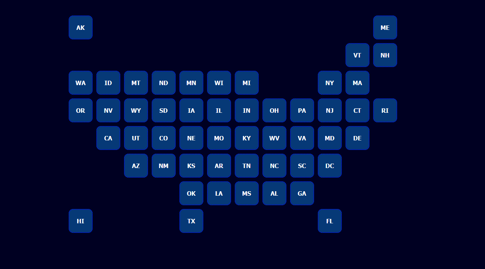

# Covid Stats

# Contact
JJoanet / justinHAYESdouglas

## Description
This application allows the user to quickly get all pertinent information about a State's current Covid-19 situation. All information is accurate and refreshed on a daily basis. This application utilizes a mix of Node.js, Express.js, MySQL, dotenv, sequelize, require, Object Oriented Programming. 

## Table of Contents
- [Installation](#Dependancies)
- [Testing](#Testing)
- [Credits](#Credits)
- [Screenshot](#Screenshot)

## Dependancies
<npm i>

## Testing
N/A

## Credits
Front end design and construction by Justin, back end framework and construction by Jeremy.

## Screenshot
